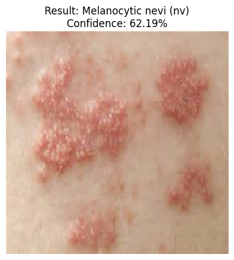

# 🩺 Skin Disease Detection using MobileNetV2

## 📌 Overview

This project is a Deep Learning based Skin Disease Detection System developed using **MobileNetV2** and the **HAM10000 dataset**. The model automatically classifies skin lesion images into seven different disease categories and provides a confidence score for each prediction.

The aim of this project is to demonstrate how Artificial Intelligence can assist in the early screening of skin diseases.

---

## 🎯 Problem Statement

Early identification of skin diseases is important for timely medical treatment. Manual diagnosis requires expert dermatologists and can be time-consuming.

This project uses Transfer Learning with MobileNetV2 to classify dermatoscopic images into different disease categories, providing a fast and intelligent prediction system.

---

## 🏗️ Model Architecture

- MobileNetV2 (Transfer Learning)
- Global Average Pooling
- Dense Layer (128 neurons)
- Dropout (0.3)
- Softmax Output Layer (7 Classes)

---

## 📊 Dataset

**HAM10000 (Human Against Machine with 10000 Training Images)**

The dataset contains more than **10,000 dermatoscopic images** divided into **7 different skin disease classes**.

### Disease Classes

- Actinic Keratoses (akiec)
- Basal Cell Carcinoma (bcc)
- Benign Keratosis-like Lesions (bkl)
- Dermatofibroma (df)
- Melanocytic Nevi (nv)
- Melanoma (mel)
- Vascular Lesions (vasc)

---

## 🚀 Technologies Used

- Python
- TensorFlow
- Keras
- MobileNetV2
- NumPy
- Pandas
- Matplotlib
- OpenCV
- Google Colab

---

## ✨ Features

- Automatic image preprocessing
- Transfer Learning
- Seven disease classification
- Confidence score prediction
- Image upload for testing

---

## 📂 Project Structure

```
skin-disease-detection/
│
├── README.md
├── requirements.txt
├── skin_disease_detection.py
├── results/
└── notebook/
```

---

## ▶️ How to Run

```bash
pip install -r requirements.txt
python skin_disease_detection.py
```

---

## 📸 Results

### Prediction Example 1




## 🔮 Future Improvements

- Improve model accuracy
- Deploy using Streamlit
- Mobile application integration
- Clinical decision support dashboard
- Train on additional dermatology datasets

---

## 👨‍💻 Author

**Hafeez Ahmed**

BS Artificial Intelligence Student

Pakistan

GitHub: https://github.com/hafeezgee
